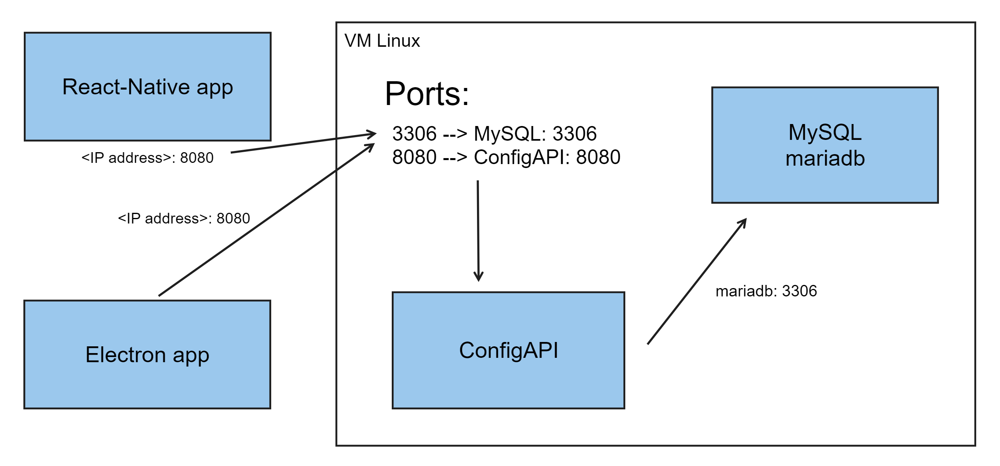

# Projet Mirroir

Document d'installation et démarrage du projet mirroir intelligent version mobile.

## Prérequis
Assurez-vous d'avoir NodeJS d'intallé avant tout.
Ouvrez une invite de commande et vérifier si NodeJS est intallé avec la comande:

```node -v```

## Setup projet

Installer les packages node_module avec la commande:

```npm install```

Ouvrez le fichier `defaultLink.js` et modifier le code avec le code ci-dessous en remplacent localhost par votre adresse IPv4.

```javascript
export const defaultLink = {
  "api" : "http://localhost:8080/"
}
```

Si vous ne connaissez pas votre adresse IP. Vous pouvez la trouver en entrant la commande `ipconfig` dans le terminal sur Windows ou `ifconfig | grep "inet " | grep -v 127.0.0.1` dans un terminal sur MacOS.

## Lancer le projet

Pour lancer le projet, entrer la commande via le script pour npm:

```npm start```

Vous pouvez aussi lancer le projet via expo directement:

```npx expo start -c```

## Lien répertoire Git

Liens Bitbucket: <http://bitbucket.cstjean.qc.ca:7990/projects/A23-MULTI-BLL>

## Schema du projet


